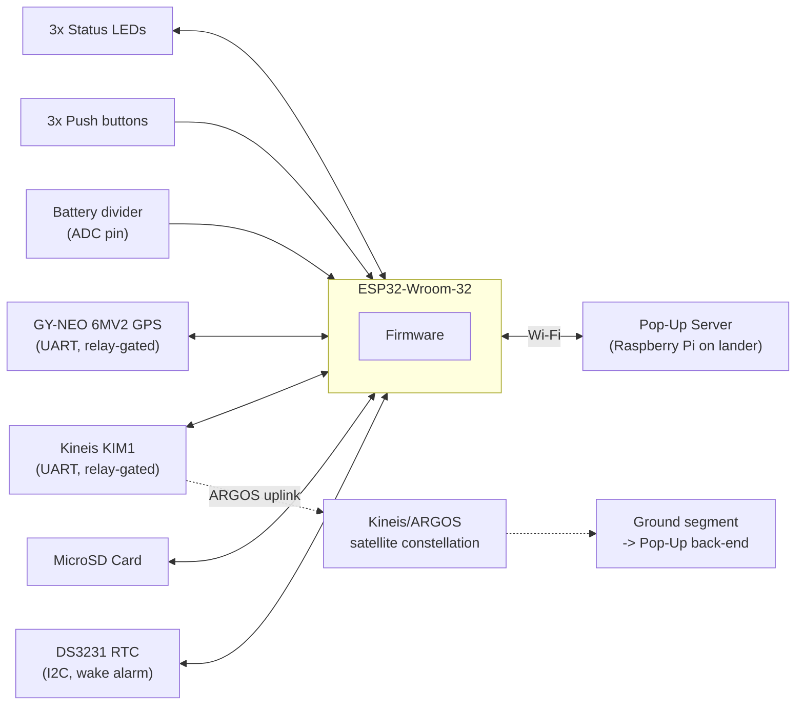
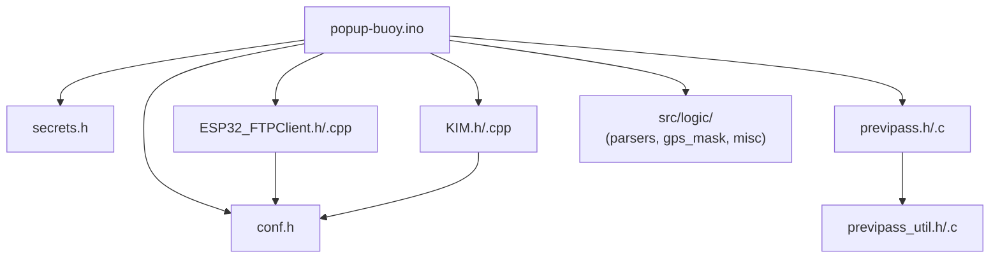
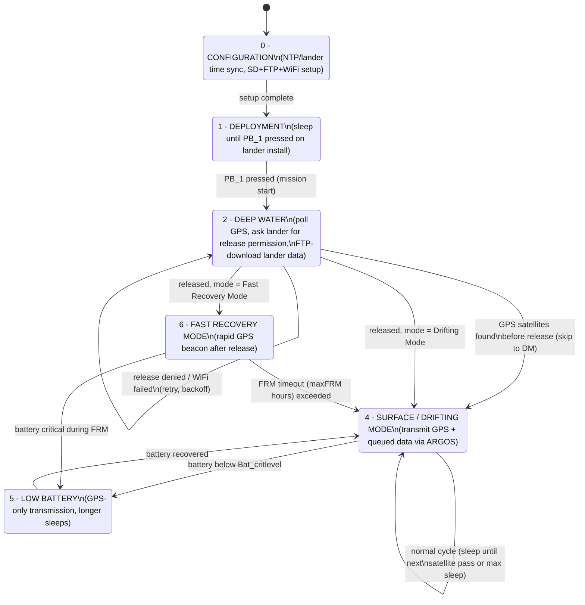
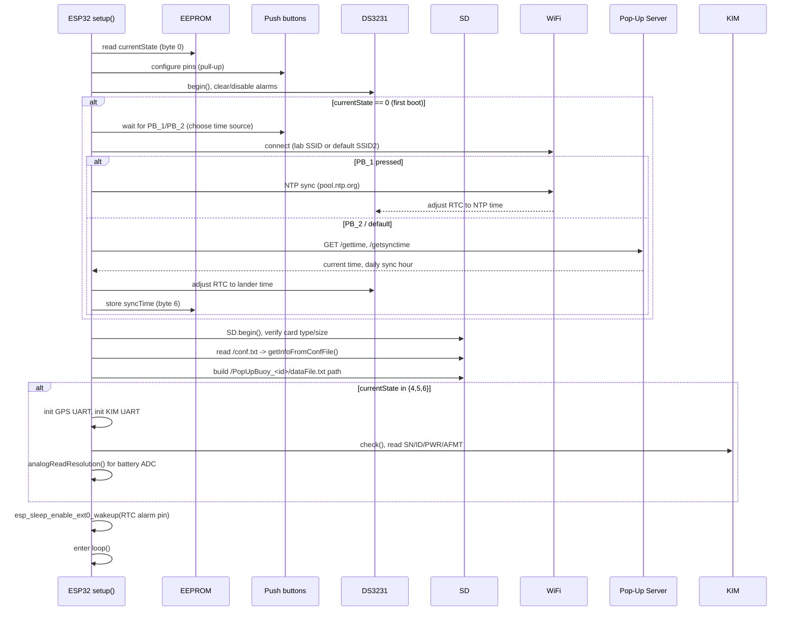
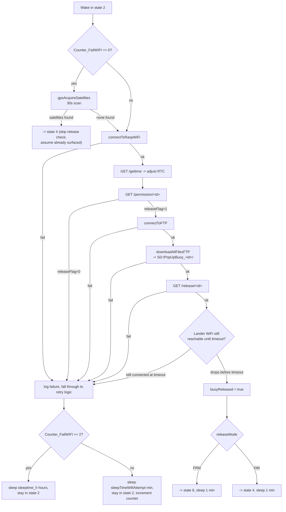
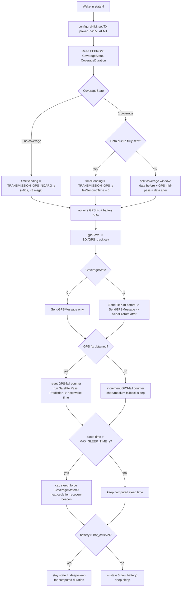

# Pop-Up Buoy — Firmware Architecture

This document describes the firmware that runs on the Pop-Up Buoy, part of the PLOME project
(UPC — Universitat Politècnica de Catalunya). The buoy is an ESP32-based device that sits attached
to a seafloor lander, waits for a release signal, floats to the surface, downloads the lander's
recorded data over Wi-Fi/FTP, and relays that data (plus GPS position) to shore over the Kineis/ARGOS
satellite network.

For the counterpart server that the buoy talks to over Wi-Fi/FTP, see
[popup-server](https://github.com/obsea-upc/popup-server).

## Table of contents

- [Hardware](#hardware)
- [Repository layout](#repository-layout)
- [Firmware architecture](#firmware-architecture)
- [Buoy state machine](#buoy-state-machine)
- [Boot / setup sequence](#boot--setup-sequence)
- [State walkthroughs](#state-walkthroughs)
  - [State 0 — Configuration](#state-0--configuration)
  - [State 1 — Deployment](#state-1--deployment)
  - [State 2 — Deep water / release](#state-2--deep-water--release)
  - [State 4 — Surface / Drifting Mode](#state-4--surface--drifting-mode)
  - [State 5 — Low battery](#state-5--low-battery)
  - [State 6 — Fast Recovery Mode](#state-6--fast-recovery-mode)
- [Satellite pass prediction (SPP)](#satellite-pass-prediction-spp)
- [Persistent storage](#persistent-storage)
- [Configuration reference](#configuration-reference)
- [Build & flash](#build--flash)
- [Known rough edges](#known-rough-edges)

## Hardware

| Component | Purpose |
|---|---|
| ESP32-Wroom-32 (EZSBC) | Main MCU, Wi-Fi |
| MicroSD card + adapter | Config, logs, GPS track, data queue |
| RTC module (DS3231) | Timekeeping across deep-sleep cycles, wake alarm |
| GPS module (GY-NEO 6MV2, u-blox) | Position + UTC time fix |
| Kineis KIM1 (v2) modem | ARGOS satellite uplink |
| Step-up converter (U3V16F5) | Power regulation |
| 2× solid-state relay (Crydom CN024D05) | Power-gate GPS+KIM and the SD card independently |
| 3× push button, 3× LED (R/Y/G) | Local operator interface (mode select, status) |

## Repository layout

| File | Role |
|---|---|
| `popup-buoy.ino` | Main sketch: state machine, all application logic |
| `conf.h` | Compile-time hardware pins, timing constants, feature flags |
| `secrets.h` | Wi-Fi SSIDs/passwords and FTP server credentials (network/site-specific, edit before flashing) |
| `KIM.h` / `KIM.cpp` | Driver for the Kineis KIM1 modem (AT-command wrapper over UART) |
| `ESP32_FTPClient.h` / `ESP32_FTPClient.cpp` | Minimal FTP client used to pull directory listings and files from the lander |
| `previpass.h` / `previpass.c` | Kineis PREVIPASS library: computes ARGOS satellite pass predictions from orbital bulletins |
| `previpass_util.h` / `previpass_util.c` | Math/date helpers used by PREVIPASS |
| `src/logic/` | Pure, Arduino-independent extraction of the sketch's parsing/encoding logic (HTTP JSON response parsers, GPS message masking, SD-card line splitters, seconds→h/m/s, EEPROM coverage-duration byte packing), unit tested on the host machine — see [docs/TEST_PLAN.md](TEST_PLAN.md). Lives under `src/` (not a top-level folder) because that's the one subfolder the Arduino build system compiles recursively. |
| `test/native/` | Host-machine (no ESP32 hardware/toolchain needed) unit tests for `previpass`/`previpass_util` and `src/logic/` — see [docs/TEST_PLAN.md](TEST_PLAN.md) |
| `README.md` | Project blurb, authors, link to server repo |

## Firmware architecture

The whole application is a single Arduino sketch built around one persistent variable,
`currentState`, stored in EEPROM byte 0 so it survives deep-sleep/reboot cycles. Every
`loop()` iteration:

1. Reads the three push buttons (`pushButtonRefresh`) — used only for manual overrides/testing.
2. Runs a `switch` on `currentState` that performs the work for that phase of the mission and
   ends by calling `SleepModeSequence(...)`, which powers down peripherals and puts the ESP32
   into deep sleep until the external RTC alarm (or a timer, in "light sleep" helper `goToSleep`)
   wakes it again.

Because the ESP32 deep-sleeps between almost every meaningful action, **all cross-cycle state
lives in EEPROM** (current state, ARGOS coverage flag/duration, GPS/Wi-Fi failure counters, NTP
sync hour) or on the **SD card** (log, GPS track, data queue + send progress, AOP satellite
table, user config).

## Buoy state machine

`currentState` (EEPROM byte 0) drives the `switch (currentState)` in `loop()`.

Two extra `PBState` shortcuts exist in `loop()` purely for bench testing (pressing PB_2 jumps
straight to state 4 with fake ARGOS coverage; PB_3 jumps to state 6) — they are marked in the
code as **"ATTENTION THIS MUST BE REMOVED"** and should not be relied upon in production builds.

`ReleaseMode` (returned by the lander's `/permission` endpoint) picks the post-release branch:

- **FRM — Fast Recovery Mode** (state 6): tight GPS beacon loop, for quick boat pickup.
- **DM — Drifting Mode** (state 4): normal ARGOS-scheduled surface routine, for long-duration drift.

## Boot / setup sequence

`setup()` runs once per boot/wake-from-reset (not on every deep-sleep wake, which restarts the
sketch but preserves EEPROM/SD state):

## State walkthroughs

### State 0 — Configuration

First-boot only. Syncs the RTC (NTP or lander time), reads `/conf.txt` from the SD card into
the in-memory config variables, and immediately advances to state 1.

### State 1 — Deployment

The buoy blinks the red LED and blocks on `PB_1` — this represents the buoy sitting on the boat
or dock waiting for the operator to physically arm it before it is attached to the lander and
sent to the seafloor. Once pressed, it moves to state 2 and deep-sleeps for
`TIME_TO_SLEEP_STATE1_h`/`_m` (from `/conf.txt`) to allow time for deployment before the first
release check.

### State 2 — Deep water / release

Runs once per wake while the buoy is attached to (or has just detached from) the lander on the
seafloor, waiting for the lander to authorize release.

Key behaviors:

- If GPS finds satellites *before* release succeeds, the code assumes the buoy has already
  surfaced independently and jumps straight to state 4 (Drifting Mode) rather than keep retrying
  the release handshake.
- Release "success" is inferred from the lander's Wi-Fi AP disappearing before a timeout — the
  buoy expects the lander to drop its own network once the release relay fires.
- Wi-Fi failures are retried with two tiers of backoff: quick retries (`sleepTimeWifiAttempt`
  minutes) for the first two attempts, then falls back to `sleeptime_h` hours per lander-configured
  cycle.

### State 4 — Surface / Drifting Mode

Runs once per wake at the surface. Combines ARGOS transmission with satellite-pass prediction to
decide the next wake time.

`SendGPSMessage`/`SendFileKim`/`SendDataMessage` all funnel through `KIM.send_data(...)`, framing
an ARGOS `AT+TX=` command; each transmission is followed by an `INTERVAL_MS`-scaled sleep so
consecutive KIM messages respect the required inter-message spacing.

### State 5 — Low battery

Same shape as state 4 but simplified: all available transmission time goes to the GPS beacon
(no data-queue transmission), sleep times are stretched by `CRIT_FACTOR` (default ×3), and an SPP
error falls back to a flat 3-hour sleep instead of retrying immediately. Returns to state 4 once
`Vin_ADC` rises back above `Bat_critlevel`.

### State 6 — Fast Recovery Mode

Entered right after release when the lander says `FRM`. Runs a tight loop — acquire GPS,
transmit, repeat every ~30s — for up to `maxFRM` hours (from `/conf.txt`), keeping peripherals
powered the whole time (the only state that skips the sleep-based peripheral power gating).
Exits to state 4 (Drifting Mode) on FRM timeout, or to state 5 if the battery drops critical
mid-loop.

## Satellite pass prediction (SPP)

`NextSatellite()` wraps the Kineis PREVIPASS library (`previpass.c`) to compute when the next
ARGOS satellite will be visible from the buoy's current GPS fix:

1. Loads the on-SD AOP (orbital bulletin) table `/AOP.txt` via `readSatelliteData` /
   `parseLine` (up to `maxAOPSize` = 10 satellites).
2. Builds a `PredictionPassConfiguration_t` (lat/long, prediction window = now → +1 day, minimum
   elevation, etc.) and calls `PREVIPASS_compute_next_pass` once per satellite in the table,
   keeping the earliest pass.
3. Subtracts `TIME_LESS_BEFORE_AWAKENING` (30s margin) from the seconds-until-pass so the MCU
   wakes slightly early.
4. Handles two edge cases explicitly:
   - **Overlapping coverage** (still inside a pass whose remaining duration > 70s): keep
     transmitting immediately rather than sleeping.
   - **SPP error** (pass computation returns ≤0 with no usable remaining coverage): short
     recovery sleep (60s in states 4/6, 3h in state 5) and retry.
5. Persists the computed coverage duration to EEPROM (bytes 2–3) so the next wake in state 4/5/6
   knows how long the upcoming pass will last without recomputing.

`updateMinElev()` exists to progressively relax the minimum elevation requirement as more of the
data queue has been sent (fewer rows remaining -> lower elevation threshold -> more frequent,
lower-quality passes accepted), but it is currently **not called** — `MinElev` is instead read
once from `/conf.txt` and only overridden to `critMinElev` in state 5.

## Persistent storage

### EEPROM (7 bytes, `EEPROM_SIZE`)

| Byte | Field | Written by |
|---|---|---|
| 0 | `currentState` | `eepromSaveState` / `changeStateTo` |
| 1 | `CoverageState` (0/1) | `SetCoverageStateTo` |
| 2–3 | `Decimal_CoverageDuration` (16-bit, big-endian) | `eepromSaveTimeCoverage` |
| 4 | `Counter_FailGPS` | `eepromSaveCounterGPSFail` |
| 5 | `Counter_FailWIFI` | `eepromSaveCounterWIFIFail` |
| 6 | `syncTime` (daily lander-sync hour, 0–23) | set in `setup()` / state 0 |

### SD card files

| Path | Written/read by | Purpose |
|---|---|---|
| `/conf.txt` | read by `getInfoFromConfFile` | Deployment-specific tuning (see [Configuration reference](#configuration-reference)) — lets operators tune a mission without recompiling |
| `/LogFile.txt` | `writeLogFile` (appended everywhere) | Timestamped event log, state-tagged |
| `/GPS_track.csv` | `saveGPStoSD` | `lat,long,year,month,day,hour,minute,second;` per fix |
| `/progressFile.txt` | `readSuccessFile` / `SaveInProgressFile` | `row:sentCount` — resume pointer into the data queue across sleep cycles |
| `/PopUpBuoy_<id>/dataFile.txt` | downloaded via FTP, read by `GetLineDataFile` | Queue of lander-recorded data lines to relay over ARGOS |
| `/AOP.txt` | `readSatelliteData` | ARGOS satellite orbital bulletin table used by SPP |

`initializationprocedure()` (state-1 PB shortcut / re-init path) wipes `LogFile`, `GPS_track.csv`
and `progressFile.txt` and recreates the progress file at `1:0` to start a mission clean.

## Configuration reference

### `conf.h` (compile-time)

Pin assignments, debug flags (`SERIAL_DEBUG`), EEPROM size, one of `WORK_office` /
`WORK_office2` / `WORK_home` / `WORK_rasp` / `WORK_intothedeep` selecting which Wi-Fi
credential block in `secrets.h` is active, KIM/GPS UART pins and bauds, and ARGOS timing
constants (`TIME_LESS_BEFORE_AWAKENING`, `CRIT_FACTOR`, `maxAOPSize`).

### `secrets.h` (network credentials — edit per deployment)

Wi-Fi SSID/password pairs (selected by the `WORK_*` define in `conf.h`) and the FTP
server IP/user/password/port used to reach the Pop-Up Server on the lander. This file is
site-specific; the top of `popup-buoy.ino` explicitly calls out that it must be modified before
flashing a buoy for a new deployment.

### `/conf.txt` (SD card, runtime, per-mission)

Simple `KEY=VALUE` lines parsed by `getInfoFromConfFile()`:

| Key | Feeds variable | Meaning |
|---|---|---|
| `idBuoy` | `idBuoy` | Buoy ID, used in FTP paths and lander API calls |
| `NumberOfSendingEachLineFromData` | `MaxNbrMsgSendingDataFile` | Repeats per data line before advancing the queue |
| `MAX_GPS_TIMEOUT` | `maxGPSTimeout` | GPS fix timeout (ms) |
| `MAX_WIFI_TIMEOUT` | `maxWIFITimeout` | Wi-Fi connect timeout (ms) |
| `TIME_TO_SLEEP_STATE1_h` / `_m` | `sleeptime_s1_h/m` | Deployment sleep before first release check |
| `TIME_TO_SLEEP_ERROR_WIFI_m` | `sleepTimeWifiAttempt` | Retry sleep on early Wi-Fi failures |
| `TIME_TO_SLEEP_ERROR_GPS_s` | `sleeptime_errorGPS_s` | Sleep after 1st/2nd GPS fail |
| `TIME_TO_SLEEP_ERROR_GPS_RECURRENT_s` | `sleeptime_errorGPS_recurrent_s` | Sleep after 3rd+ GPS fail |
| `MAX_SLEEP_TIME_s` | `max_sleep_time_s` | Sleep cap, forces periodic recovery beacon |
| `TRANSMISSION_GPS_s` | `timetransm_GPS_s` | GPS TX time when ARGOS coverage present |
| `TRANSMISSION_GPS_NOARG_s` | `timetransm_GPS_noArg_s` | GPS TX time with no coverage |
| `MAX_FRM_TIME_h` | `maxFRM` | Fast Recovery Mode timeout |
| `FRM_SLEEP_s` / `FRM_SLEEP_NOGPS_s` | `FRMsleepTime_s` / `_fail_s` | (defined, currently unused by state 6's loop) |
| `MinElev` | `MinElev` | Minimum satellite elevation for SPP (deg) |
| `PWR2` / `PWR3` | `PWR2` / `PWR3` | KIM TX power presets (states 0–5 vs. 6) |
| `FILE_BLINK_LED` | `fileBlinkLed` | Enable LED blink feedback during FTP download |
| `BAT_CRIT_LEVEL` | `Bat_critlevel` | Battery voltage (mV/1000) below which state 5 triggers |

## Build & flash

- Arduino IDE with **ESP32 board package by Espressif Systems, pinned to v2.0.14** (the sketch
  header explicitly warns against newer versions).
- Libraries: `RTClib`, `NTPClient`, `TinyGPSPlus`, `FastCRC`, plus the ESP32 core's `WiFi`,
  `HTTPClient`, `SD`, `EEPROM`, `Wire`, `SoftwareSerial`.
- Copy/edit `secrets.h` with the target deployment's Wi-Fi and FTP credentials, and pick the
  matching `WORK_*` define in `conf.h`.
- Prepare the SD card with a `/conf.txt` (see table above) before first boot into state 0.
- `#define SERIAL_DEBUG` in `conf.h` controls whether verbose logging goes to the USB serial
  console (115200 baud); disable for production to save power/time in blocking print calls.

## Known rough edges

Documented here because they're visible in the code and worth knowing before modifying it:

- `loop()` `PBState` cases 2 and 3 are bench-test shortcuts that force-jump into states 4/6 and
  are marked in-code for removal before production use.
- `GetLineDataFile()` has a code path (SD file fails to open) that falls off the end of a
  non-void function without a `return`, relying on undefined behavior for the caller in that
  case (SD failing to open here would already be a hard fault upstream).
- `updateMinElev()` is dead code — implemented but never called.
- **Found while writing `test/native/` (see [docs/TEST_PLAN.md](TEST_PLAN.md)):**
  - `PREVIPASS_UTIL_date_stu90_calendar` (vendored `previpass_util.c:196`) reads
    `__ek_quanti[dateTime->gpsMonth - 1][isLeapYear]` before checking `dateTime->gpsMonth <= 12`
    in its `while` loop condition. Because C evaluates the left side of `&&` first, this is a real
    out-of-bounds global read (confirmed under AddressSanitizer) on **every single date in
    December**, every year — i.e. it fires continuously during a large fraction of any
    multi-month deployment. In this environment the read happens to land on adjacent-but-mapped
    memory and the final computed date still comes out correct (the OOB value gets ANDed away by
    the now-false `month <= 12`), so it hasn't been observed to produce a wrong date — but it's
    undefined behavior and not guaranteed to stay harmless on different compilers/optimization
    levels/memory layouts (including the actual ESP32 target, which hasn't been checked under a
    sanitizer). Worth a 1-line upstream fix (swap the order of the two `&&` operands) reported to
    the Kineis PREVIPASS maintainers, since this file is vendored, not buoy-project code. See
    `test/native/test_previpass_known_issues.c`.
  - `parsePermissionResponse`'s failure-message extraction (`popup-buoy.ino:1461-1468`,
    `messageStart += 10`) is off by one: `"message":"` is 11 characters, so `+10` lands the cursor
    *on* the value's opening quote rather than just past it, and the immediately-following
    `indexOf("\"", messageStart)` then matches that same quote — `messageEnd == messageStart`, so
    the extracted message is always an empty string. The server's actual permission-denial reason
    (e.g. `popup_id 9 not found`) is silently dropped from `LogFile.txt` every time; only
    `"Request failed: "` gets logged. Doesn't affect release decision logic, only observability —
    but makes diagnosing a stuck buoy from its log harder than it should be. One-character fix
    (`+10` → `+11`). See `logic/parsers.cpp` and
    `test/native/test_parsers.cpp::permission_success_false_with_message_is_a_known_bug_dropping_the_message`.
- `FRM_SLEEP_s` / `FRM_SLEEP_NOGPS_s` are parsed from `/conf.txt` into globals that state 6's
  loop does not currently reference (it hardcodes `timeSending = 30`).
